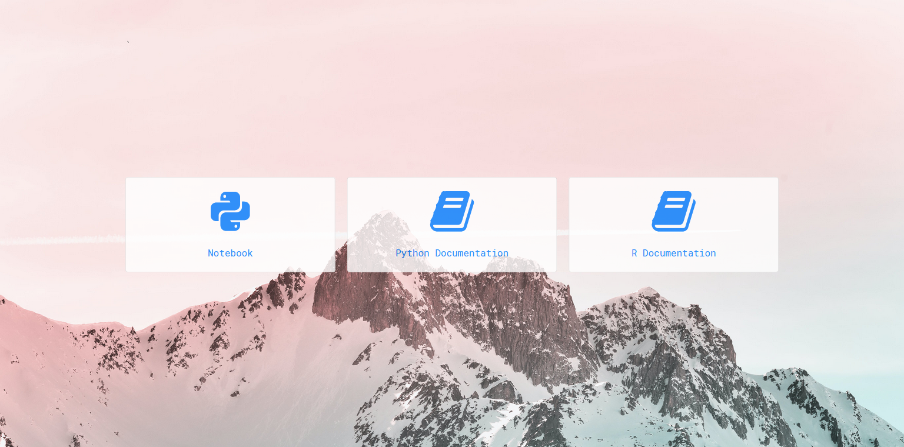

# Self-Hosted GIS Toolkit

This repository contains a `docker-compose` file and a directory structure that facilitates a self-hosted solution containing:

- a web dashboard (pictured below)
- a Jupyter Notebook app based on the [datascience-notebook](https://hub.docker.com/r/jupyter/datascience-notebook) docker image

